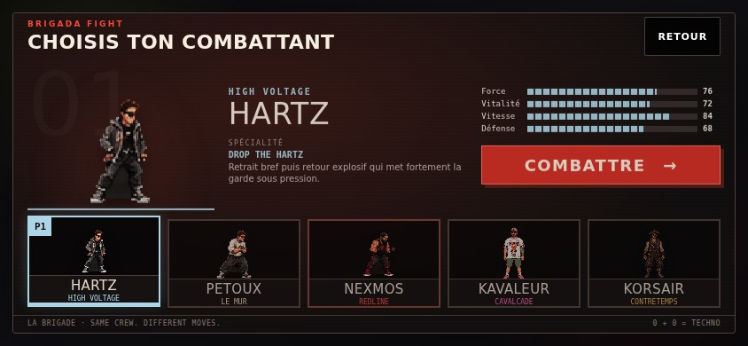
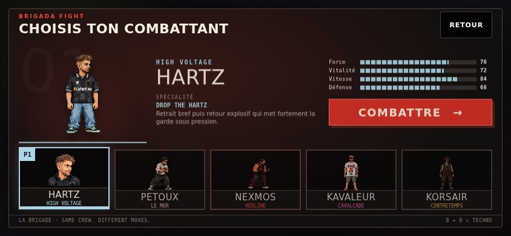
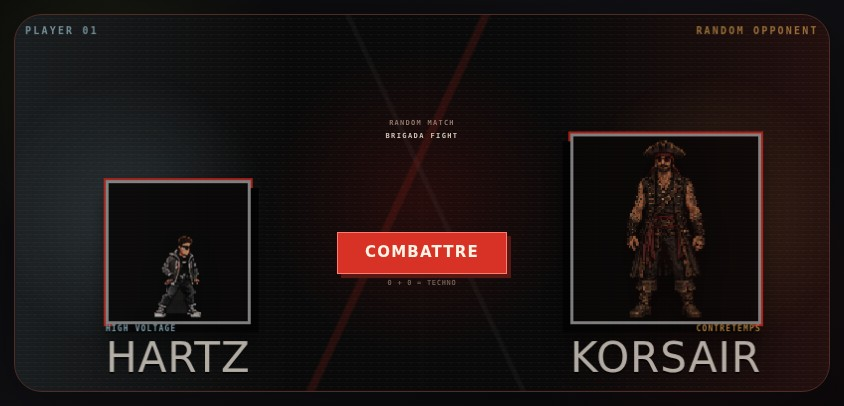
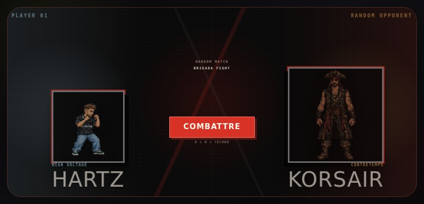
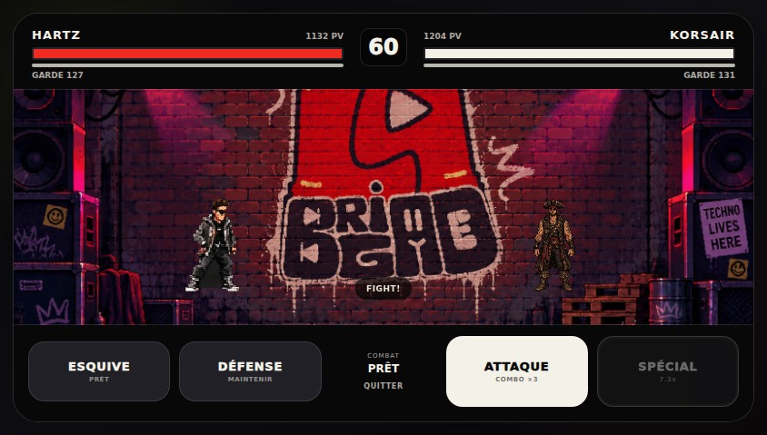

# HARTZ v2 integration QA

Approved source: HARTZ-import-pack.zip. All twelve PNG files are copied byte-for-byte. SHA-256 hashes and measured alpha bounds are recorded in asset-mapping.json and checked by Playwright.

Selection uses front plus the dedicated portrait; VS uses idle; actions and results use their matching fixed-pose PNG. No generated demonstration files are shipped.

Combat keeps the existing 1.3 multiplier, stage positions, baseline and state presentation offsets. HARTZ alone uses its 340px idle height as the normalization reference. All poses retain a 448×416 canvas with 20px transparent bottom padding. React fits this wide canvas by height while preserving its intrinsic ratio and center. The four other fighters retain their previous rendering rules.

Before/after captures were taken on the same 844×390 viewport. Additional crouch and React fallback captures cover 667×375 and 1280×720 as well. JPEG copies are review images only; the production PNGs have not been recompressed.

| Screen | Before | After |
|---|---|---|
| Selection |  |  |
| VS |  |  |
| Combat |  |  |

The fallback test deliberately fails an opponent action texture so Phaser never takes ownership; HARTZ PNGs remain available. Normal operation verifies that both React sprites are hidden once Phaser is ready.

No gameplay, HUD, background, controls, stats, AI, timing or cooldown changes. Vercel previews remain disabled by the existing deploymentEnabled rules. This PR must not merge without user approval.
