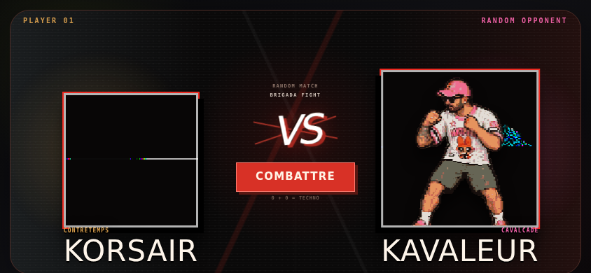
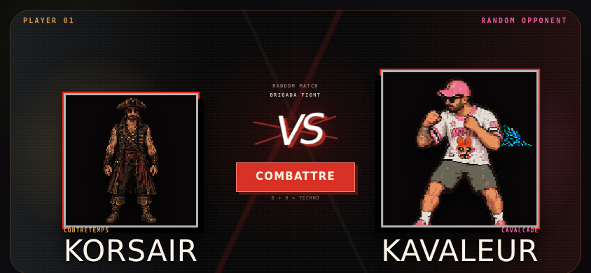
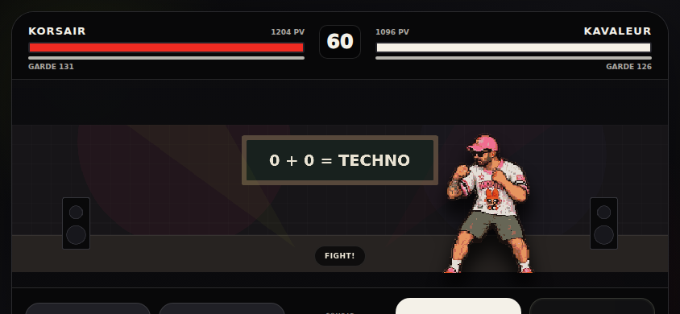
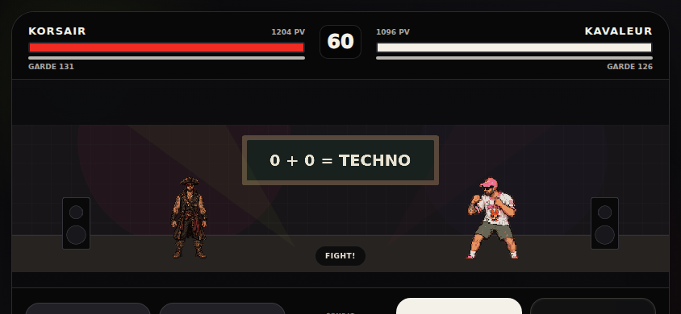

# KORSAIR rendering repair

Base: f231316 (PR #27). Only KORSAIR assets/integration are changed.

## Findings

- `idle.png`: truncated/invalid compressed image stream and damaged end chunk. The VS points to this file correctly, but browsers cannot decode it reliably.
- `attack.png`: malformed palette/chunk boundaries and invalid compressed data.
- `hit.png`, `dodge.png`: incorrect tRNS CRCs. Browser-dependent handling of an invalid transparency chunk can lose transparency or reject the texture.
- Phaser's existing all-textures-ready gate fails for the pair. React takes over for BOTH fighters; its different stage layout makes the opponent appear larger. No pairwise normalization, fighter tuning or global 1.3 multiplier is changed by this repair.
- A more specific retired VS atlas background still showed behind KORSAIR's standalone image. Disable only this KORSAIR background source.

## Repair and limitation

Repair recoverable PNG CRCs and encode the KORSAIR family as explicit RGBA, preserving decoded RGB/alpha values. All background borders are alpha zero. The original broken streams remain in git history.

**The exact damaged idle and attack poses could not be recovered.** Use the intact v2 front pose for idle/VS, and the intact v2 defend pose for the shared attack texture. This preserves the new character design but temporarily reuses these poses. Restoring distinct poses requires intact exports from the approved source sheet; no character was redrawn. Existing per-state Phaser motion and gameplay remain unchanged.

`fighterImage` remains idle.png; `fighterArtImage` remains front.png; result win remains win.png. All ten animation state mappings resolve to valid PNGs. Existing source bounds (128/124/2), uniform scale, ground line and +30% remain correct for idle.

## Verification

- PNG decode, alpha-zero perimeter, substantial transparent region and complete visible silhouette for every mapped state, front and portrait.
- Mobile landscape 844x390 and desktop 1280x720: KORSAIR against all four opponents; selection/VS pixels, Phaser ready, 200.2 visible height and ground 326 on both sides, no horizontal overflow.
- Existing KORSAIR result flow now waits for real attack cooldowns instead of spending its fixed attempt budget polling disabled buttons.
- GitHub CI runs the full existing unit, typecheck, build and Chromium suite.

## Before / after (844x390)

| Screen | Before | After |
|---|---|---|
| VS |  |  |
| Combat |  |  |

The captured browser rejects the corrupt sprite rather than displaying its black rectangle. PNG integrity and alpha assertions also guard the alternative decoder behavior reported by the user.
